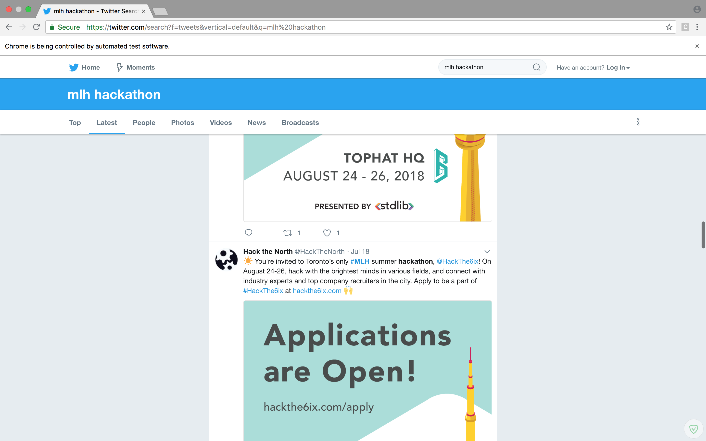
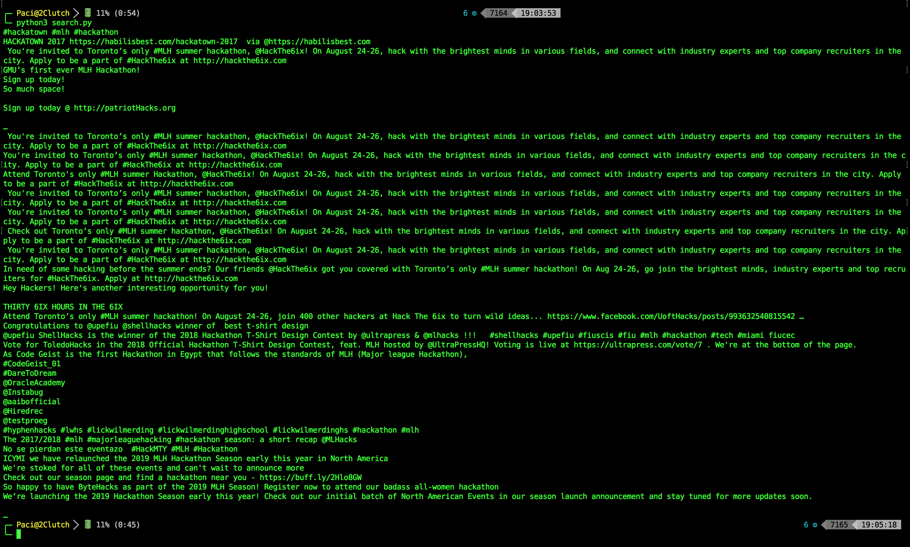

# Introduction

This is a project I completed as a take-home interview challenge. The objective was 
built a web scraper for twitter to retrieve tweets pertaining to a certain topic. For my 
assignment, I had to go with `mlh localhost`.

# Setup

First thing you will want to do is clone the repository by running: <br>
```commandline
git clone https://github.com/2Clutch/mlh_workshop_challenge
```

Next, you will want to install `Selenium` Selenium is open-source web-based automation tool.
It is the single driving force behind our application. To install it, run:
```commandline
pip install selenium
```

Finally, you will to run the project. To do so, while still on the command line, run:
```commandline
python3 search.py
```

Once you run the command above, our application wil open a new Chrome page as shown below 
and scroll down automatically by itself.



<br>

When the scrolling is complete, head back to your to your terminal. Once there you will 
something similar to the image below.



What you see there is the text-content of the tweets, our application
parsed.
